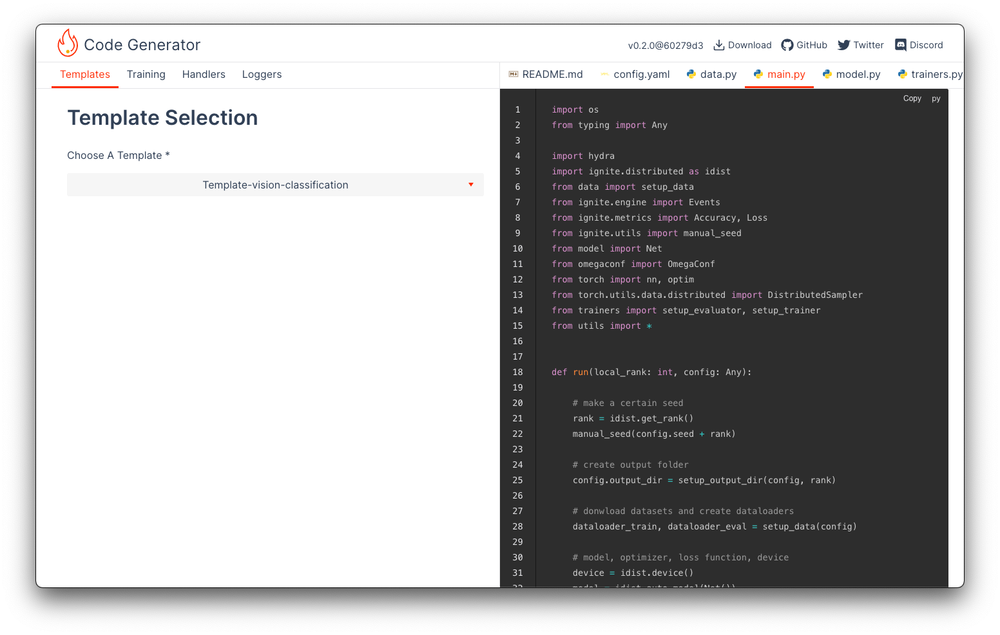

# Code Generator [![ci][gha-img]][gha-url]

Application to generate your training scripts with [PyTorch-Ignite](https://github.com/pytorch/ignite).

## Contribution

Please see [Contribution Guide](./CONTRIBUTING.md).

## Acknowledgements

This project is highly inspired from https://traingenerator.jrieke.com/ project, big thanks to its author Johannes Rieke!

Development of this project is supported by NumFOCUS Small Development Grant. We are very grateful to them for this support!

## License

[BSD 3-Clause](./LICENSE)

[gha-img]: https://github.com/pytorch-ignite/code-generator/actions/workflows/ci.yml/badge.svg?branch=main
[gha-url]: https://github.com/pytorch-ignite/code-generator/actions/workflows/ci.yml
